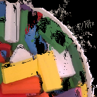
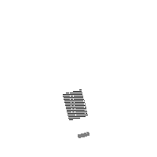

# data_driven_dg

## Overview
This package provides an end-to-end data driven approach for picking thin objects from a dense clutter. It is developed based on our pevious model-based manipulation technique named 'dig-grasping', where the object is picked and singulated out of the cluster by a direct physical interaction with gripper. In this package, we train the robot to learn how to plan for optimized dig-grasping parameters to pick objects in different shapes. 

## Dataset
### 1. For pre-training the network
This dataset includes a) RGB heightmap images showing the real scene of objects, b) 2-D arrays for ground truth labels . The groud truth label is of the same size as the RGB heightmap, and obtained following our our model-based dig-grasping method. Each point in the label is associated with a class that represents for a background or successful/failed dig-grasp. Here shows an example:
<p align = "center">
 
 
</p>

Other data can be found via:
- [**Pre-train dataset for domino only**](https://drive.google.com/file/d/1vmRiNhAcFs5DHyphjMjxNsaeJSbrf9bS/view?usp=sharing)
- [**Pre-train dataset for various shapes**](https://drive.google.com/file/d/1nsvOPXmXoLaq1A82Nuii7YMZymVChAHW/view?usp=sharing)


### 2. For training the network in real
Given the pre-trained network, we collect the data by the robot performs trial and errer in real experiments. The ground truth label is obtained by a successful/failed dig-grasp in the real experiment.
Some data can be found in
- [**Training dataset from real**](https://drive.google.com/file/d/1pO7yF8Vfzpg9Dkj9qa6YMXFDm5Xi8G-s/view?usp=sharing)

## Software
### 1. Make heightmap
We first preprocess the raw images captured by the robot into heightmaps.
- Input: RGB image and depth image
```
python heightmap.py
```
### 2. Make pre-train dataset
- Input: RGB heightmap and depth heightmap
```
python data_annotation_label_all_shape.py
```
### 3. Collect data in real experiments
```
python main_for_data_collection_comprehensive.py
```
### 3. Train the network
- Input: Dataset that includes heightmap images and ground truth label arrays
```
python train.py
```
### 4. Test the trained network in real
```
python main_light.py
```
